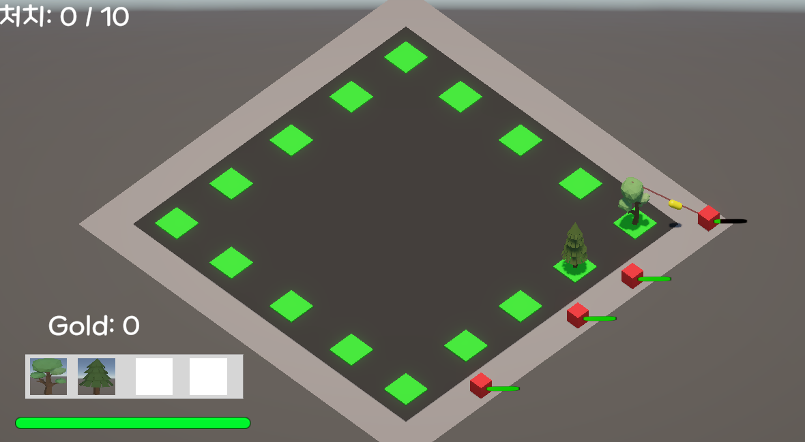
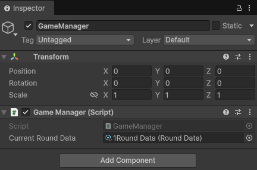

<div align="center">
 
 # 3D_Project(제목 미정)

  현재 핵심 게임 루프(몬스터 웨이브 스폰 및 타워 배치/생존)의 프로토타이핑을 완료한 3D 전략 디펜스(또는 생존) 프로젝트입니다.  

  <p align="center">
  
</p>
  
</div>


## 📈 성장 기록 (Development Logs)
**내 코드에는 증거가 있어야 한다** 는 신념으로, 개발 과정에서 마주한 기술적 고민과 아키텍처 개선 과정을 모두 기록하고 있습니다. 
단순한 기능 구현을 넘어, 더 나은 구조를 찾기 위해 스스로 질문하고 답해온 기록들입니다.
* 📂 **[2026년 개발 일지 아카이브](./개발일지)**

---

## 🎮 게임 플레이 & 특징

* **핵심 생존 루프 (Survival Core Loop):**
  * 플레이어는 시작 시 보유한 골드를 소모하여 원하는 위치에 전략적으로 타워(나무)를 배치할 수 있습니다.
     * 추가 개발로 몬스터 처치, 웨이브 종료 시 보상으로 골드를 획득 하게 할 예정입니다.
  * 주기적으로 몰려오는 적(몬스터)들의 웨이브를 방어하며, 웨이브마다 몬스터의 체력과 이동속도가 증가해 이를 극복해 나가는 디펜스 구조를 가집니다.
  * 일반 몬스터 처치 수 조건을 달성하면 최종 보스가 등장하며, 보스를 처치하면 라운드를 클리어하고 다음 스테이지 순환 루프로 이어집니다.
  * 만약 몬스터가 코스를 다 돌면 플레이어 자체의 HP가 감소되어 0이 되면 패배하는 구조입니다.

* **타워 배치 및 경제 시스템 (Placement & Economy):**
  * 단순 배치가 아닌, 나무를 배치할 비용, 골드 소모 및 배치 전 어떤 나무가 배치 되는지 마우스 실시간 미리보기(Preview) 이미지 시스템을 통해 직관적인 빌드 UX를 제공합니다.
  * 마우스 우클릭을 통해 언제든지 배치를 즉시 취소할 수 있으며, 골드가 부족할 경우 예외 처리를 통해 불필요한 선택 동작을 사전에 차단합니다.

* **나무(타워) 종류별 고유 특징:**
  * 기본 공격형 나무(`AttackTree`) 외에도 몬스터에게 상태 이상(`SlowTree`)을 부여하는 특수 나무들을 전략적으로 조합할 수 있습니다.
  * 타워는 몬스터의 공격으로 인해 일정 횟수 이상 피격 시 파괴되며, 파괴 시 슬로우 효과가 해제되거나 타워 슬롯(`TreeSlot`)이 초기화되어 다시 새로운 타워를 배치할 수 있는 동적 인터랙션을 제공합니다.

* **개발자 디버깅 및 시각화 UX:**
  * Gizmos를 활용해 유니티 에디터(Scene View)에서 몬스터의 공격 사거리를 실시간으로 시각화하여, 개발 및 밸런스 조정 과정에서 직관적인 디버깅이 가능하도록 지원합니다.

---

## Build History

<details open>
<summary><b>v0.4.0 (2026.09.1) - 최신 주요 업데이트</b></summary>
<br/>

- **메인 화면 복귀 및 게임 종료 네비게이션 구현**:
  * 일시정지 메뉴 내 버튼을 통한 메인 화면 씬(Scene) 이동 및 게임 종료(Application.Quit) 기능 추가로 플레이어 조작 흐름 완성
  * 빌드 및 에디터 환경을 고려한 게임씬에서도 게임 종료(Application.Quit) 기능 추가
- **GitHub Releases를 통한 v0.4.0 정식 빌드 .zip 배포 및 Notion 포트폴리오 다운로드 링크 연동 완료**
  
</details>

<details>
<summary><b>v0.3.0 (2026.08.19) - 최신 주요 업데이트</b></summary>
<br/>

- **메인 화면 씬 추가 및 확장성 고려한 씬 전환 로직**:
  * 메인 화면 씬을 추가하고, 버튼 클릭 시 씬 이동을 처리하는 구조 설계
  * MainMenuController.cs의 LoadGameScene()함수 내부에 씬 이름을 직접 고정하는 방식과 매개변수를 활용한 동적 씬 전환(재사용성/확장성) 방식을 비교·검토하여 현재 프로젝트 규모에 최적화된 구조 적용
    * 현재는 게임씬 이동 기능 밖에 없어서 **인스펙터 수정 중의 휴먼에러를 방지하기 위해 하드코딩으로 함수 내부에 씬 이름을 적는 방식으로 결정**
    * (단일 게임 씬 이동 기능만 존재하여 직관성과 구현 간소화를 위해 하드코딩 방식을 채택했으나, 향후 다중 씬 확장 시 매개변수 구조로 즉각 리팩토링할 수 있도록 설계적 한계와 대안을 인지)
- **흐름 제어 및 타이밍 시스템(플레이 전 카운트다운)**: GameManager.cs에 Time.timeScale 기반의 게임 시작 전 대기 및 카운트다운 로직 구현
- **중앙 집중형 매니저 및 DI 적용**: GameManager.cs의 역할을 확장하여 몬스터 스탯/등장 최종 검증 및 골드 관리 시스템을 중앙 집중화하고 의존성 주입(DI) 구조 적용
- **UI 및 연출 고도화**:
  * 몬스터 처치 시 머리 위로 획득 골드(+10G) 플로팅 텍스트 연출 추가(페이드인/아웃)
  * 몬스터 프리팹마다 붙어 있던 무거운 월드 스페이스 캔버스(체력바 UI)를 제거하고, Camera.main.WorldToScreenPoint를 활용해 스크린 좌표계 기반으로 체력바 UI가 몬스터의 위치를 동적으로 추적하도록 구조 개편
- **성능 최적화 (Optimization)**
  * 몬스터 프리팹 내부의 무거운 월드 스페이스 캔버스(EnemyHpBar)를 제거하여 오버헤드 감소 (다수의 몬스터 생성 시 발생하는 UI 렌더링 부하 최소화, 매 프레임 불필요하게 소모되던 UI 연산 낭비 제거)
  * 몬스터 및 나무의 대상 추적 로직을 무거운 물리 엔진 연산에서 가벼운 수학 로직으로 변경하여 불필요한 비주얼/물리 연산 제거

</details>

<details>
<summary><b>v0.2.0 (2026.07.11)</b></summary>
<br/>
 
- **시스템 아키텍처 개선 (DIP 적용)**: ITree 인터페이스 도입을 통해 나무(타워) 객체 간 의존성을 제거하고, 새로운 나무 타입 추가가 용이하도록 확장성 확보
- **데이터 기반 설계(Data-Driven)**: EnemyData 등 주요 데이터를 ScriptableObject로 이관하여 하드코딩 제거 및 관리 효율화
- **UX 고도화**: LineRenderer를 활용한 몬스터 공격 사거리 런타임 시각화 구현
- **인터랙션 강화**: OnMouseDown을 통한 몬스터 선택/토글 기능 구현 및 씬 뷰 디버깅(OnDrawGizmosSelected) 최적화

</details>

<details>
<summary><b>v0.1.0 (2026.06.27)</b></summary>
<br/>
 
- **코어 시스템 구현**: 주기적 몬스터 스폰 및 웨이브 시스템 구축 
- **배치 및 전투**: 배치 위치 기반의 타워(공격/슬로우 나무) 선택 배치 시스템 구현
- **승리 조건**: 일반 몬스터 10마리 처치 시 보스 몬스터 등장 및 전체 처치 시 클리어 UI 출력
- **UI 피드백**: 배치 포인트 시스템 및 버튼 Color Tint를 통한 인터랙션 시각화

</details>

---


##  주요 문제 해결 과정 & 인사이트

<details>
<summary><b>UI 씬 이동 구조 리팩토링: 하드코딩된 씬 전환 방식에서 매개변수 기반 유연한 설계로의 전환</b></summary>
<br/>

### 🚨 문제 상황 (Problem)

- 메인 화면의 버튼(게임 시작 등)을 통해 특정 씬으로 이동할 때, 씬 이동 함수 내부에 이동할 씬 이름("GameScene")을 직접 문자열로 고정(하드코딩)하여 구현했습니다.
- 이로 인해 향후 상점 씬, 스테이지 선택 씬 등 새로운 씬으로 이동하는 버튼이 추가될 때마다 씬 이름별로 중복된 함수를 계속해서 새로 만들어야 하는 구조적 한계가 발생했습니다.

### 🔍 원인 분석 및 접근 (Insight)

- 현재 단계에서의 실용성과 한계 인식:
  * 현재 프로젝트는(v0.3.0) 메인 화면과 게임 씬 구조라 당장 이동할 씬이 하나(GameScene)뿐이므로, 스크립트에 씬 이름을 직접 박아두는 하드코딩 방식(LoadGameScene())이 당장 구현하기에 가장 직관적이고 빠릅니다.

- 확장성을 위한 구조적 고찰 (트레이드오프):
  * 하지만 **"스크립트에서 적으면 되지, 인스펙터나 버튼 OnClick 에디터에서 값을 조작하는 것은 번거롭다"** 는 생각에 갇히면, 나중에 씬이 늘어났을 때 비슷한 함수의 양이 늘어나는 문제가 생깁니다.
  * 따라서 당장은 현재 규모에 맞춰 가볍게 유지하되, **향후 씬 확장 시**에는 함수를 하나로 공통화하고 세부 데이터(어떤 씬으로 이동할 것인지)는 유니티 에디터 창에서 직접 주입(매개변수 방식)하는 구조로 리팩토링해야 한다는 설계적 인사이트를 얻었습니다.
 
### 🛠 해결 과정 (Solution)

- 현재 단계에 맞춘 실용적 구현 (MainMenuController.cs)
  * 현재 프로젝트는 메인 화면과 게임 씬으로 구성되어 당장 이동할 씬이 GameScene 하나뿐이므로, 구현의 직관성과 속도를 위해 스크립트에 씬 이름을 직접 고정하는 하드코딩 방식(LoadGameScene())을 채택하여 유지했습니다.

```
public class MainMenuController : MonoBehaviour
{
    //[기존 방식] 현재 프로젝트 규모에 맞춘 하드코딩 방식 (단일 씬 이동)
    public void LoadGameScene()
    {
        SceneManager.LoadScene("GameScene");
    }

    //[확장 방식] 매개변수를 활용하여 에디터(OnClick)에서 씬 이름을 주입받는 범용 함수
    public void LoadScene(string sceneName)
    {
        SceneManager.LoadScene(sceneName);
    }

    public void QuitGame()//게임 종료 버튼(에디터, 빌드 환경)
    {
        Debug.Log("게임 종료!");
        #if UNITY_EDITOR
        UnityEditor.EditorApplication.isPlaying = false;
        #else
        Application.Quit();
        #endif
    }
}
```

- 향후 확장성을 고려한 리팩토링 설계 (매개변수 방식 고찰)
  * 만약 향후 메인화면 씬에서 상점 씬, 스테이지 씬 등 다양한 씬으로 확장해야 하는 상황이 온다면, 위와 같은 하드코딩 방식은 함수를 매번 새로 만들어야 하므로 유지보수성이 떨어집니다.
  * 따라서 씬이 늘어날 경우에 대비하여, string 타입의 매개변수를 받는 범용 함수 LoadScene(string sceneName)으로 전환하고 유니티 에디터의 OnClick 입력 칸에서 씬 이름을 동적으로 주입하는 구조로 개선할 수 있도록 설계 방향을 정립했습니다.

- 현재 단계의 구현 결과 및 이점
  * 에디터와 스크립트 간의 복잡한 매개변수 바인딩 과정을 일시적으로 생략함으로써, 초기 빌드 단계에서의 휴먼 에러를 방지하고 직관적이고 빠른 디버깅 환경을 구축했습니다.
  * 불필요한 오버엔지니어링을 배제하고 당장 프로젝트에 필요한 최소한의 구현에 집중하여 개발 속도를 최적화했습니다.


### 💡 인사이트 및 트레이드오프 (Insights & Trade-off)

- 1. 현재의 실용성과 미래의 확장성 사이의 트레이드오프:
  * 무조건 복잡하고 범용적인 코드를 짜는 것이 능사가 아니며, 현재 프로젝트의 규모(단일 씬 이동)에 맞는 가장 직관적이고 빠른 방식(하드코딩)을 선택하는 실용적인 판단력의 중요성을 배웠습니다.
- 2. 오버엔지니어링 경계와 확장 가능성 확보:
  * 당장은 하드코딩으로 진행 하더라도, 훗날에 씬이 확장되었을 때 발생할 코드 중복 문제를 미리 인지하고 매개변수(LoadScene(string)) 기반의 유연한 구조로 언제든 리팩토링할 수 있도록 아키텍처적 시야를 넓히는 계기가 되었습니다.


</details>


<details>
<summary><b>불필요한 물리 연산 제거 및 순수 수학적 거리 계산(sqrMagnitude)을 통한 사거리 탐색 최적화</b></summary>
<br/>

### 🚨 문제 상황 (Problem)

- 기존에는 `LineRenderer` 범위와 실제 충돌 범위가 일치하지 않거나, 물리 엔진(`OverlapSphere, SphereCollider`, 트리거 이벤트)에 전적으로 의존하여 충돌을 감지했습니다.
- 물리 엔진(`OverlapSphere`)과 `SphereCollider`에 의존하여 충돌을 감지하다 보니, 이로 인해 시각적 범위와 실제 판정의 불일치, 불필요한 물리 연산 부하, 그리고 오브젝트 간 높은 결합도 문제가 발생했습니다.

### 🔍 원인 분석 및 접근 (Insight)

- 물리 콜라이더를 계속 유지하면 오브젝트 간의 불필요한 의존성이 높아지고, 모호한 감지 영역으로 인해 버그 대처가 까다로워진다고 판단했습니다.
- 무거운 물리 연산 대신, 루트 연산(`Vector3.Distance`)을 배제하고 제곱 거리를 비교하는 순수 수학적 거리 계산(`sqrMagnitude`) 방식을 도입하여 성능과 정확도를 모두 잡기로 결정했습니다.
- 이를 공격형 타워(AttackTree), 슬로우 타워(SlowTree), 그리고 몬스터(`EnemyAttack.cs`) 전반에 공통으로 적용하여 아키텍처의 일관성을 높였습니다.

### 🛠 해결 및 결과 (Solution & Result)

- **공통 최적화 로직의 핵심 흐름:**
1. `Object.FindObjectsByType`을 통해 물리 콜라이더 의존성을 제거하고 씬 내 타겟을 직접 탐색합니다.
2. `Vector3.Distance`(루트 연산) 대신 사거리를 미리 제곱(`rangeSq`)해 두고, `sqrMagnitude`를 비교하여 CPU 연산 부하를 최적화했습니다.
3. `dir.y = 0` 처리를 통해 디펜스 게임의 평면 사거리 판정 오차를 사전에 방지했습니다.
```
//물리 엔진(OverlapSphere 등)을 배제하고 씬 내 오브젝트를 대상으로 순수 수학적 거리 계산 수행
TreeHealth[] allTrees = Object.FindObjectsByType<TreeHealth>(FindObjectsSortMode.None);

float rangeSq = treeData.Range * treeData.Range;//사거리 제곱 미리 계산

foreach (var target in allTrees)
{
    if (target == null) continue;

    //Y축 높이 차이를 배제하고 평면 거리 계산 후 sqrMagnitude 적용
    Vector3 dir = target.transform.position - transform.position;
    dir.y = 0; 
    float distanceSq = dir.sqrMagnitude; 

    if (distanceSq <= rangeSq)
    {
        //가장 가까운 타겟 선정 또는 범위 내 리스트 관리 로직 수행
    }
}
```
- 모든 타워 및 몬스터 프리팹에서 불필요한 SphereCollider를 완전히 제거하여 물리 연산 부하를 대폭 줄이고 로직의 명확성을 확보했습니다.
- 스크립트 간 의존성(결합도)을 낮추어 향후 새로운 타워나 몬스터 타입이 추가되더라도 확장성이 높은 견고한 구조를 구축했습니다.


### 💡 인사이트 및 트레이드오프 (Insights & Trade-off)

1. **물리 엔진과 커스텀 로직의 트레이드오프(Trade-off) 이해**
   * 유니티의 물리 엔진(Collider, OverlapSphere)이 편리하지만, 프로젝트의 성격(예: 디펜스 게임의 다수 타워/몬스터 탐지)에 따라 오히려 불필요한 연산 부하와 시각적 오차(사거리 불일치)를 유발할 수 있음을 체감했습니다. 상황에 맞게 물리 엔진을    과감히 걷어내고 순수 코드로 제어하는 결단력의 중요성을 배웠습니다.
2. **제곱 거리 연산(sqrMagnitude)을 통한 성능 최적화 마인드셋**
   * 매 프레임 거리 비교 시 무거운 루트 연산(Vector3.Distance 또는 피타고라스 제곱근) 대신, 미리 제곱한 값을 비교하는 `sqrMagnitude`를 적용함으로써 컴퓨터 과학적 관점에서 성능 최적화를 고려하는 습관을 기를 수 있었습니다.   
3. **프로젝트 전반의 아키텍처 일관성 확보**
   * 단발성 수정에 그치지 않고, 공격형 타워(AttackTree), 슬로우 타워(SlowTree), 그리고 몬스터(EnemyAttack)에 이르기까지 프로젝트 전반의 탐색 로직을 일관된 구조로 리팩토링하면서, 확장성 높은 코드가 무엇인지 깊이 있게 고민해 보는 소중한 계기가 되었습니다.


</details>


<details>
<summary><b>비활성화된 UI 오브젝트 탐색 실패 문제 해결 및 자동 참조 로직 설계(PauseManager.cs)</b></summary>
<br/>


### 🚨 문제 상황 (Problem)

- GameObject.Find()를 사용하여 PausePanel을 탐색하려 했으나, UI가 비활성화(SetActive(false))된 상태일 경우 탐색이 불가능하여 null이 반환되는 문제가 발생했습니다.
- 기존의 수동 드래그 앤 드롭(Inspector 연결) 방식은 프로젝트 규모가 커질수록 참조 누락의 위험이 있고, 유지보수성이 떨어진다는 단점이 있었습니다.
      
### 🔍 원인 분석 및 접근 (Insight)

- **탐색 제한**: 유니티의 GameObject.Find()는 활성화된 오브젝트만을 대상으로 탐색을 수행하므로, 비활성화된 오브젝트는 찾을 수 없는 설계적 제약이 있습니다.
- **조용한 실패(Silent Failure)**: null이 반환되었음에도 불구하고, if (pausePanel != null)과 같은 방어 코드에 의해 로직이 정상적으로 건너뛰어지면서, 시스템이 '작동하지 않음'을 인지하기까지 시간이 지체되었습니다.

### 🛠 해결 과정

1. **전역 탐색 로직 도입**: Resources.FindObjectsOfTypeAll<Canvas>()를 사용하여 씬 내의 모든 캔버스(비활성화 상태 포함)를 탐색 범위에 포함하였습니다.
2. **인스턴스 필터링**: canvas.gameObject.scene.name != null 조건을 추가하여, 프리팹이 아닌 실제 씬에 배치된 캔버스 인스턴스만을 정교하게 필터링하였습니다.
3. **계층 탐색 구현**: Transform.Find("PausePanel") 메서드를 활용하여 캔버스 자식 오브젝트 중 특정 이름의 UI를 동적으로 탐색하고 할당하였습니다.
4. **시스템 자동화**: 별도의 인스펙터 연결 없이 Start() 시점에 시스템이 스스로 UI를 찾아 연결하도록 설계하여, 개발 편의성과 시스템의 견고함을 동시에 확보하였습니다.
💻 핵심 코드 구현
```csharp 
void Start()
{
    //1. 씬 내의 모든 캔버스(비활성화 포함)를 탐색
    Canvas[] allCanvases = Resources.FindObjectsOfTypeAll<Canvas>();
    
    foreach (Canvas canvas in allCanvases)
    {
        //2. 씬에 포함된 객체만 필터링 (프리팹 제외)
        if (canvas.gameObject.scene.name != null)
        {
            //3. 자식 중 "PausePanel" 이름을 가진 오브젝트를 탐색
            Transform found = canvas.transform.Find("PausePanel");
            if (found != null)
            {
                pausePanel = found.gameObject;
                pausePanel.SetActive(false);//초기 상태 비활성화
                break;//탐색 완료 후 종료
            }
        }
    }
}
```


### 💡 인사이트 및 트레이드오프 (Insights & Trade-off)

1. **유니티 검색 메커니즘 이해**: 호출 시점과 오브젝트의 활성/비활성 여부에 따라 탐색 함수들이 제각각 다른 결과를 도출함을 이해하였습니다. 상황에 맞는 적절한 API 선택이 중요함을 배웠습니다.
2. **방어적 설계의 양면성**: if (null) 방어 코드는 버그를 막는 좋은 수단이지만, 근본적인 원인을 은폐할 수 있음을 깨달았습니다. 따라서 로직 오류를 빠르게 파악하기 위해 적절한 로그와 디버깅을 병행해야 한다는 점을 익혔습니다.
3. **코드의 견고함**: 하드코딩된 참조를 제거하고 시스템이 스스로 환경을 인식하게 만드는 '자동 연결' 설계가 대규모 프로젝트의 유지보수 효율을 어떻게 극대화하는지 체감하였습니다.
4. **방법론의 한계와 트레이드오프**:
   * **성능 부하**: Resources.FindObjectsOfTypeAll은 강력하지만, 씬 전체를 탐색하므로 프로젝트 규모가 매우 커질 경우 성능상 부하가 발생할 수 있습니다.
   * **하드코딩 의존성**: 또한, 특정 "이름(PausePanel)"에 의존하는 방식은 하드코딩된 문자열이 변경될 경우 대응이 어렵습니다.
   * **향후 개선 계획**: 현재 단계에서는 유지보수성과 생산성 측면에서 가장 효율적이라 판단하여 채택했으나, 향후 프로젝트가 확장된다면 ScriptableObject 기반의 의존성 주입이나 Tag/Layer 시스템을 활용한, 보다 유연한 구조로 개선할 계획입니다.

</details>


<details>
<summary><b>유연한 게임 시스템 구축을 위한 리팩토링 프로젝트</b></summary> 
      

      
이 프로젝트는 하드코딩된 로직을 ScriptableObject 기반의 데이터 구조로 전환하여 **시스템의 확장성과 코드의 유지보수성** 을 높이는 데 중점을 두고 개발되었습니다.<br/>

### 🚨 문제 상황 (Problem)

- 몬스터 스탯, 스폰 속도 등 라운드별 설정값이 `EnemySpawner`와 `GameManager` 매니저 스크립트에 하드코딩되어 있어, 수치 변경 시마다 다수의 스크립트를 수정해야 하는 비효율이 발생했습니다.
- 이런 방식은 매니저 간 데이터 참조가 분산되어 있어 데이터 일관성을 유지하기 어렵고, 코드의 결합도(Coupling)가 높아 유지보수에 어려움이 있었습니다.

### 🔍 원인 분석 및 접근 (Insight)

- **데이터와 로직의 혼재**: 데이터값이 코드 내부에 직접 명시되어 있어, 게임 디자인 변경이 코드 수정으로 이어지는 구조였습니다.
- **분산된 의존성**: 여러 매니저가 각기 다른 곳에서 데이터를 참조하여, 시스템 전체의 데이터가 여러 스크립트에 흩어져 있어, **어느 쪽이 최신 설정값인지 관리하기가 매우 번거로웠습니다.**

### 🛠 해결 과정

1. **데이터 구조화(ScriptableObject)**: `RoundData` SO를 생성하여 이곳에 등장할 몬스터의 프리팹, 스폰 간격 등 라운드 설정을 에셋 파일로 분리했습니다.
2. **중앙 집중형 허브 설계**: `GameManager`를 데이터 허브로 구축하여 이 매니자 스크립트에서만 `RoundData` SO를 연결하고, 나머지 매니저가 `GameManager`를 통해서만 데이터에 접근하도록 구조를 변경했습니다.
3. **이벤트 기반 통신(Action/Delegate)**: `OnBossSpawn`, `OnGameClear` 등의 이벤트(옵저버 패턴)를 도입하여 매니저 간의 직접적인 참조를 제거하고 결합도를 낮췄습니다.
4. **로직 단순화**: SO의 데이터 존재 여부(bossPrefab != null)만으로 로직을 판단하게 하여 불필요한 조건문을 제거했습니다.

**적용 모습 (Inspector)**



**핵심 구현: 중앙 집중형 데이터 허브 (GameManager.cs)**
```csharp 
public class GameManager : MonoBehaviour
{
    public static GameManager Instance;

    [Header("Data")]
    public RoundData currentRoundData;//데이터 허브의 중심
    
    //이벤트 기반 통신: 결합도 감소
    public event Action OnBossSpawn;
    public event Action OnGameClear;

    private void Awake() => Instance = this;

    //다른 매니저들이 데이터를 참조할 창구 (직접적인 필드 접근보다 안전함)
    public RoundData GetCurrentRoundData() => currentRoundData;
    
    public void TriggerBossSpawn() => OnBossSpawn?.Invoke();
}
```
**활용 예시: EnemySpawner.cs (결합도 감소)**
```csharp
private void SpawnEnemy()
{
    //GameManager라는 '창구'를 통해서만 데이터를 가져옴
    var data = GameManager.Instance.GetCurrentRoundData();
    
    if (data.enemyPrefab != null)
    {
        Instantiate(data.enemyPrefab, spawnPoint.position, Quaternion.identity);
    }
}
```


### 💡 인사이트 및 트레이드오프 (Insights & Trade-off)
- **확장성 확보**: 이제 라운드 추가 시 코드 수정 없이 `RoundData` SO에셋 파일만 생성하면 되는 유연한 시스템을 구축했습니다.
- **설계의 중요성**: 기능 구현보다 '어떻게 시스템을 설계할 것인가', '다른 개발자들도 편하게 이 스크립트를 확인할 수 있는가' 가 개발자의 핵심 역량임을 재확인했습니다.
- **향후 개선 계획**: 현재는 라운드 데이터를 배열`(RoundData[])` 로 관리할 예정이며, 추후 인덱스 기반 자동 전환 로직을 구현하여 완전히 자동화된 웨이브 시스템을 완성할 계획입니다.
</details>
